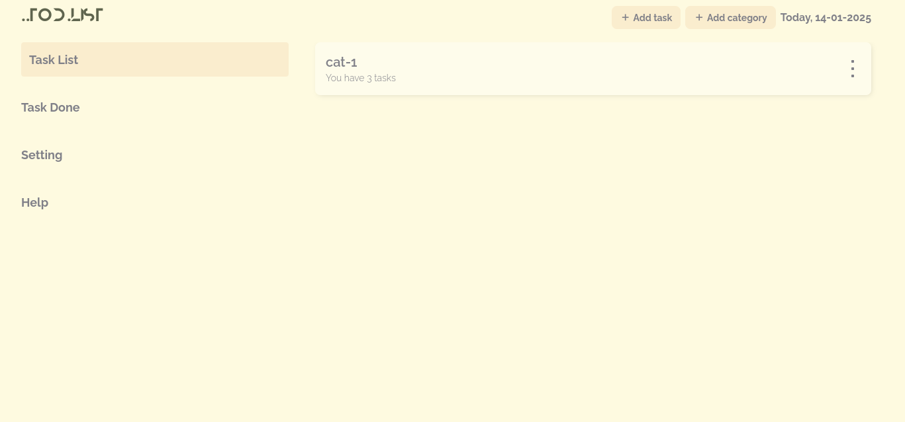
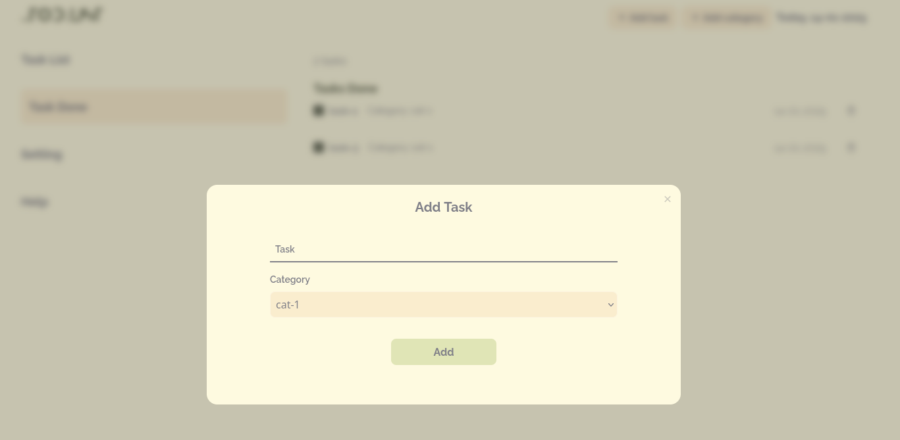
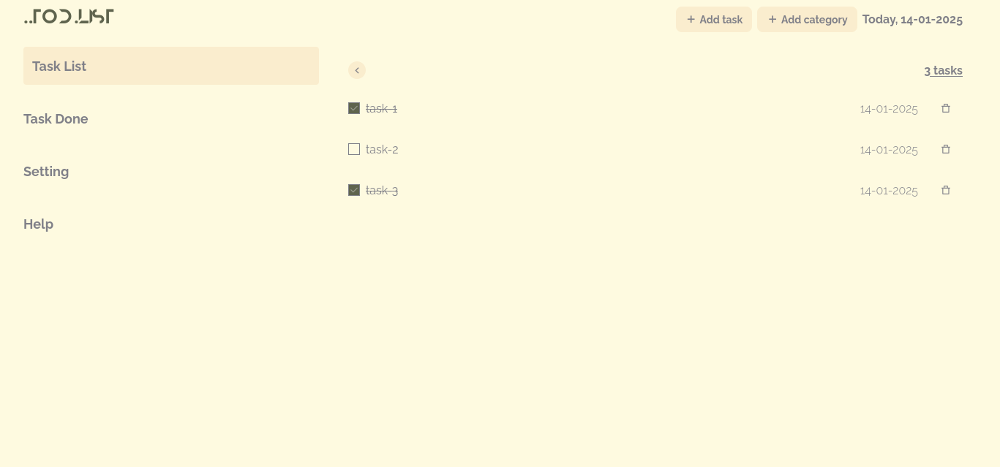

# Full HTML-CSS-JS Todo App
This is a simple full-stack Todo App built with HTML, CSS and JavaScript. The user can add a new task, delete a task, mark a task as completed, and view all the tasks that have been completed.

Here is a screenshot of the app:

---

---

The app is fully responsive and works great on both desktop and mobile devices. The app is also fully accessible and works great with screen readers.

The app is built with the following technologies:

* HTML for structuring the content
* CSS for styling the content
* JavaScript for adding interactivity to the content
* Local storage for storing data

The app is easy to use and does not require any registration or login. The user can simply open the app and start using it.

The app is also fully open source and can be forked and modified to suit the user's needs.

The app is a great example of how to build a full-stack web app with HTML, CSS and JavaScript.
